# 人工智慧導論及實作 Group 3 - Final Project Report

###### tags: `NCKU`

> **資源們**
>  - **簡報** https://www.canva.com/design/DAHKp8_TIW8/LeVHqlajXdJjoQLn4E6CKQ/view
>  - **GitHub Repository** https://github.com/mysh212/AI-Final-Project
>  - **HackMD Report** https://hackmd.io/@mysh212/H1huyG4xMx
>  - **Model 1 程式碼** https://www.kaggle.com/code/e24126270/xray-e24126270

> 建議使用此連結查看報告
> https://hackmd.io/@mysh212/H1huyG4xMx

## 一、概覽

在本次研究中，我們先後嘗試兩種不同的模型架構：


 - **模型一：CNN + Vision Transformer 雙分支融合架構**
   - EfficientNet-B4
   - Vision Transformer (ViT-B/16)
   - 自訂融合分類器（Classifier Head）

> 我們會以 ***Model 1*** 作為此模型的代稱

---

 - **模型二：各種醫療預訓練模型**
     - 模型
        - torchxrayvision 預訓練權重
        - CheXNet
        - CheXpert
    - 來源
        - Python Module
        - Hugging Face
        - GitHub 上的奇怪專案

> 我們會以 ***Model 2*** 作為此模型的代稱

---

## 二、資料分析與前處理

### 2.1 資料集分析

在資料探索階段，我們首先對資料集進行統計分析。

分析過程中發現：

1. 原始公開資料集規模約為 10 萬張影像，而本次競賽資料約為 3 萬張。
2. 原始資料集實際上屬於 Multi-label 醫療分類問題，同一張 X 光影像可能同時具有多種疾病標籤。
3. 競賽資料則將多標籤結果簡化為單一標籤，因此部分資訊可能被捨棄。
4. 各疾病類別分布極度不均衡，例如：
    - Atelectasis：約 3065 張
    - Hernia：約 71 張

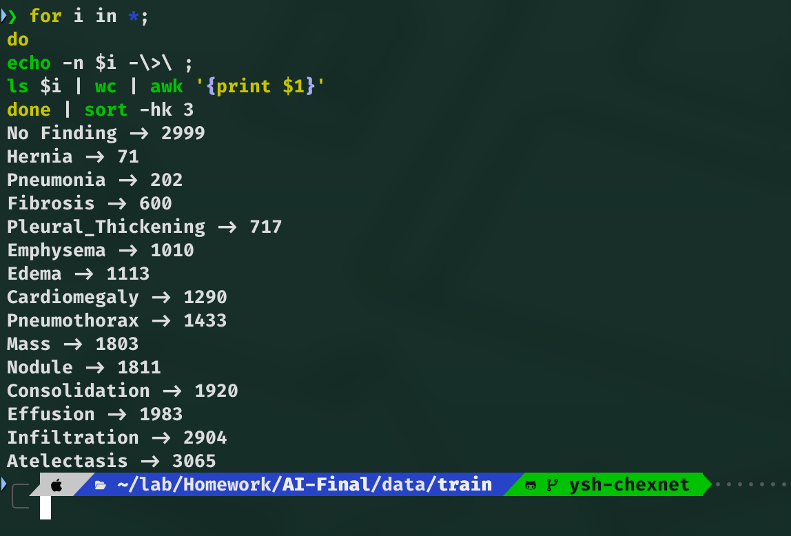
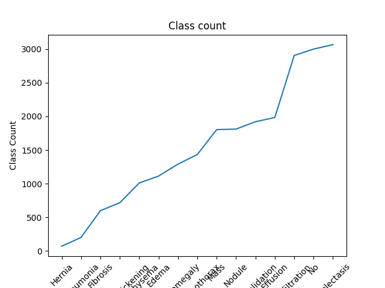


因此後續訓練必須特別考量類別不平衡問題。

> **雖然我們發現了公開測試集，但此次競賽中，我們並沒有將其投入任何模型的訓練、驗證流程中。**

### 2.2 ***Model 1*** 資料切分與預處理

#### 資料切分

模型一採用 Stratified Split（分層抽樣）：

 - 依據類別比例進行訓練集與驗證集切分
 - 維持各類別分布一致

然而後續分析發現，此方法可能造成病患資料洩漏問題：同一位病患於不同時間、不同角度拍攝的影像可能同時出現在訓練集與驗證集，導致模型記憶病患特徵而非疾病特徵，進而產生過擬合。

#### 資料增強

訓練集使用：

 - Resize
 - RandomCrop
 - RandomHorizontalFlip
 - RandomRotation(15°)
 - ColorJitter
 - ImageNet Normalize

驗證集與測試集僅進行：

 - Resize
 - Normalize

#### 類別不平衡處理

使用：

```python
nn.BCEWithLogitsLoss(pos_weight)
```

其中：

```
pos_weight = negative_samples / positive_samples
```

透過提高稀有類別損失權重，使模型更關注少數疾病樣本。

---

### 2.3 ***Model 2*** 資料切分與預處理

#### Patient-wise Split

在查閱資料的過程中，我們意外注意到本次競賽的訓練集名稱格式為：

```
[病人 ID]-[流水號].png
```

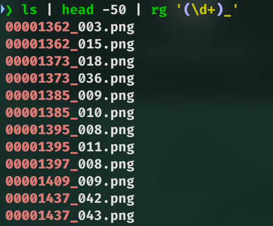

而我們能夠如此有自信是因為圖片中有些微線索（例如病人 ID 為 123 的照片中，右上角皆有一個三角形物體），因此我們決定好好利用這個發現。

>|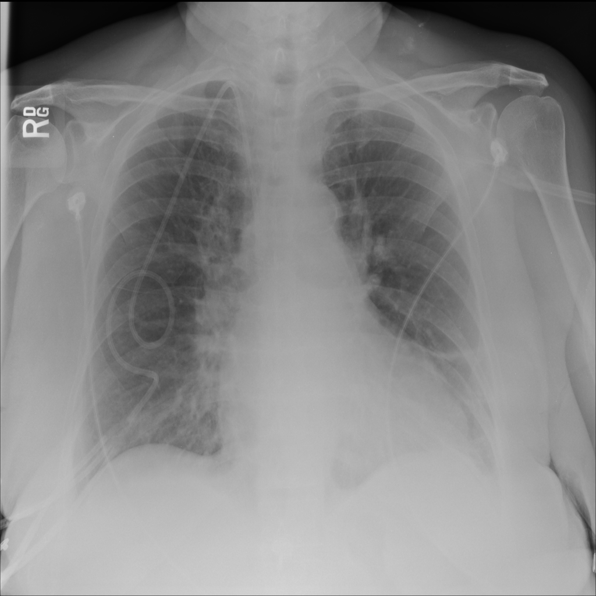|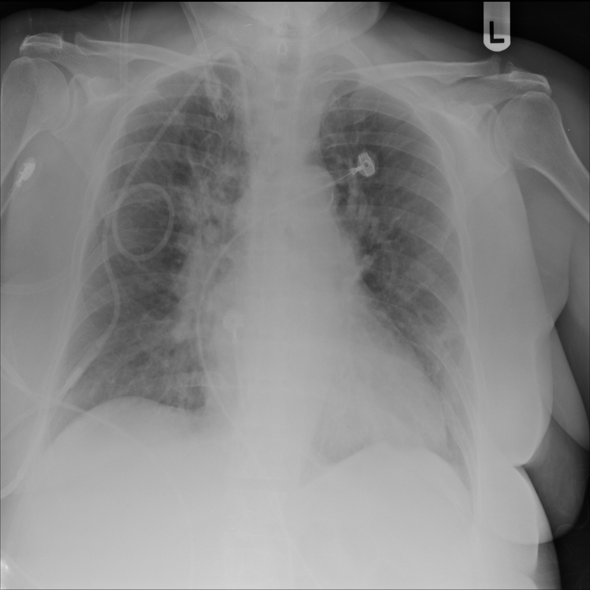|
>|:-:|:-:|
>
>上圖為 `Patience ID` 為 `00001385` 的病患，可以發現左右兩張圖都可以清晰地看到導管的輪廓，且形狀與捲曲程度相似，因此我們推斷檔名前半段為 **病人 ID**


我們使用正則表達式：

```regex
^.*/(\d+)_\d+\.png$
```

提取病患 ID (Capture group 1)，並保證：

 - 同一病患所有影像只會出現在訓練集或驗證集其中一側
 - 不會跨資料集重複出現

此方法能更真實評估模型對新病患的泛化能力。

---

#### 醫療影像像素標準化

我們使用了等比例放大公式

$$
f'_{i, j} = \frac{f_{i, j}}{2 ^ 8 - 1} \times 2 ^ {11} - 2 ^ {10}\color{gray}{, \forall\ 1 \leq i, j \leq n}
$$

其中 $n$ 為長、寬

映射後的範圍為 $[-2 ^ {10}, 2 ^ {10}]$

此區間與醫學影像常見的 Hounsfield Unit (HU) 數值範圍相近，使預訓練模型能更有效利用其已學習的醫療特徵。

---

#### 資料增強

使用 Albumentations：

 - HorizontalFlip
 - ShiftScaleRotate
 - RandomBrightnessContrast
 - GaussianBlur

以模擬不同醫療設備及拍攝條件造成的影像差異。

---

## 三、模型架構設計

### 3.1 ***Model 1*** ：CNN + ViT 雙分支融合架構

#### CNN 分支

使用：

```text
EfficientNet-B4
```

負責提取：

 - 紋理特徵
 - 局部病灶資訊
 - 平移不變性特徵

輸出維度：

```text
1792
```

---

#### ViT 分支

使用：

```text
ViT-B/16
```

負責提取：

 - 全域上下文資訊
 - 長距離依賴關係

輸出維度：

```text
768
```

---

#### 特徵融合

兩分支輸出進行串接：

```text
1792 + 768 = 2560 維
```

接入自訂分類器：

```text
LayerNorm
→ Dropout(0.3)
→ Linear(2560,512)
→ GELU
→ Dropout(0.15)
→ Linear(512,15)
```

---

### 3.2  ***Model 2*** ：各種醫療預訓練模型

模型二起初改採：

```text
torchxrayvision
densenet121-res224-all
```

此模型已於數十萬張胸腔 X 光影像預訓練，包括：

 - ChestX-ray14
 - CheXpert
 - NIH Dataset 等大型醫療資料集

因此已具備相當的醫療專屬知識。

分類器則簡化為：

```python
nn.Linear(in_features, 15)
```

直接輸出 15 類分類結果。

而其他發現請見 [十一、其他研究與發現](https://hackmd.io/b_GCdGjEQV-3KHZS5U_5OA?both#%E5%8D%81%E4%B8%80%E3%80%81%E5%85%B6%E4%BB%96%E7%A0%94%E7%A9%B6%E5%8F%8A%E7%99%BC%E7%8F%BE)

---

## 四、訓練策略

### 4.1  ***Model 1*** 訓練流程

#### Phase 1：Warm-up

 - Epoch：3
 - Backbone 凍結
 - 僅訓練 Classifier Head

目的：

避免隨機初始化權重破壞預訓練特徵。

---

#### Phase 2：Full Fine-tuning

 - Epoch：15
 - 全模型解凍
 - 224×224 輸入

使用：

```text
AdamW
CosineAnnealingLR
```

---

#### Phase 3：High Resolution Fine-tuning

 - Epoch：5
 - 解析度提升至 384×384

目的：

捕捉更細微病灶資訊。

---

### 4.2  ***Model 2*** 訓練流程

#### Stage 1：Static Training

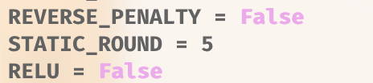

 - Epoch：5
 - 凍結 DenseNet Backbone
 - 僅訓練分類頭

---

#### Stage 2：Full Fine-tuning

 - 全部解凍

我們使用了 `ReduceLROnPlateau` ，讓 ***learning rate*** 卡住時，將其 $\times 0.1$ ，並且確保其 **不低於 $10 ^ {-5}$** 。

## 五、預測與後處理策略

### 5.1  ***Model 1***

#### Test-Time Augmentation (TTA × 4)

測試階段對同一張影像進行：

1. 原圖
2. 水平翻轉
3. 中心裁切
4. 中心裁切 + 水平翻轉

最終取平均機率：

```text
Mean Probability
```

降低預測方差。

---

#### Per-Class Threshold Tuning

針對每個類別：

```text
Threshold = 0.05 ~ 0.95
```

進行暴力搜尋（Grid Search），尋找最佳 F1 Score，此方法能有效改善類別不平衡問題。

---

#### Fallback 機制

若無任何類別超過門檻：

```text
選擇最高機率類別
```

保證輸出合法結果。

---

### 5.2  ***Model 2***

模型二採用 `argmax` 作為最終分類結果。

## 六、實驗結果

### 6.1  ***Model 1*** 結果

| 階段      | Validation AUC |
| ------- | -------------- |
| Phase 1 | 0.7272         |
| Phase 2 | 0.8152         |
| Phase 3 | 0.8214         |

雖然效能持續提升，但觀察訓練曲線可發現：

 - Train Loss 持續下降
 - Validation Loss 明顯上升

顯示模型後期出現嚴重過擬合現象。

---

### 6.2  ***Model 2*** 結果

模型二在 Kaggle Leaderboard 上取得 約 $0.31$ 的成績

相較模型一有顯著提升。

---

## 七、模型比較分析

| 項目               | 模型一                | 模型二                |
| ---------------- | ------------------ | ------------------ |
| 預訓練權重            | ImageNet           | 醫療專用 X-ray         |
| 主幹架構             | EfficientNet + ViT | DenseNet121        |
| 資料切分             | Stratified Split   | Patient-wise Split |
| 像素處理             | RGB Normalize      | HU-like Scaling    |
| Loss             | BCEWithLogitsLoss  | CrossEntropyLoss   |
| TTA              | ✓                  | ✗                  |
| Threshold Tuning | ✓                  | ✗                  |
| Kaggle 表現        | 較低                 | 較高                 |

研究結果顯示：

> 在醫療影像任務中，領域知識與資料處理策略的重要性往往高於模型複雜度本身。

雖然模型一擁有更強大的網路架構，但模型二透過醫療專用預訓練權重、Patient-wise Split 以及符合醫學特性的像素標準化，成功取得更佳泛化能力。

---

## 八、重要發現

在模型二優化過程中，我們曾嘗試將簡單的線性分類器改為帶有 ReLU 的多層感知機（MLP）。

原先預期：

```text
更複雜的分類頭
→ 更強表現
```

然而實驗結果卻顯示：

```text
Linear Head : 約 0.28
MLP Head    : 約 0.23
```

反而出現明顯退步。

我們推測：

torchxrayvision 的 DenseNet 預訓練權重已經在醫療影像潛在空間（Latent Space）中形成高度良好的特徵分布。

額外加入非線性層與大量參數後，反而破壞了原有特徵空間結構。

因此得到本研究的重要結論：

> Less is More

在特定醫療影像任務中，簡潔的後端結構可能比複雜的分類頭更有效。

---

## 九、未來工作

根據本次實驗結果，未來將朝以下方向持續優化：

### (1) 保留成功的醫療前處理

 - Patient-wise Split
 - HU-like Pixel Scaling
 - 醫療專用預訓練權重

---

### (2) 維持簡潔分類頭

基於 Less is More 的發現：

 - 減少冗餘參數
 - 降低過擬合風險

---

### (3) 移植 ***Model 1*** 的後處理技術

將模型一成功驗證的：

 - TTA × 4
 - Per-Class Threshold Tuning

整合至模型二。

---

### (4) 醫療模型集成

未來可嘗試：

 - DenseNet Ensemble
 - Medical ViT
 - CheXpert Pretrained Models

建立兼具醫療知識與泛化能力的集成架構。

---

## 十、結論

本研究比較了兩種不同設計思維的醫療影像分類模型。

模型一強調複雜架構與特徵融合能力；模型二則專注於醫療領域知識與資料處理策略。

實驗結果顯示，醫療專用預訓練權重、Patient-wise Split 以及符合醫療特性的影像標準化，對模型效能的提升遠大於單純增加網路複雜度。

本研究最終證明：

> 深入理解資料特性與應用領域，往往比單純堆疊更大型、更複雜的神經網路更為重要。

未來若能結合模型二的醫療特徵提取能力與模型一成熟的後處理技術，預期模型表現仍有進一步提升空間。

## 十一、其他研究及發現

除了課程要求中提到的幾個問題，我們還做了其他相當多的實驗，以下詳細列出：

> 以下出現的所有資料皆為 ***Model 2*** 的分支結果

### General Comparsion

|Model|Validation Loss|YES count|
|:-:|:-:|:-:|
|CheXNet - ReLU|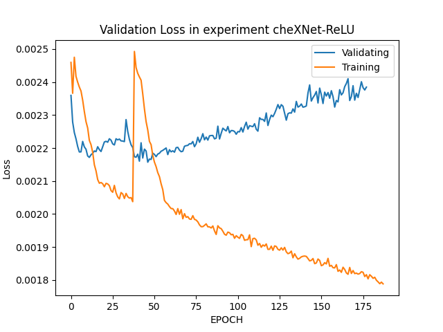 |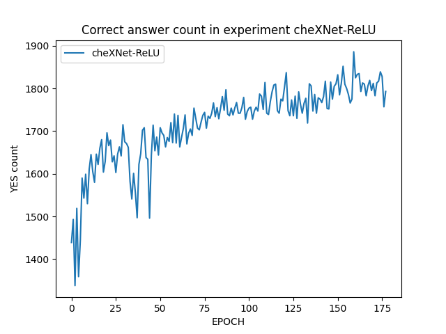|
|CheXNet - Linear|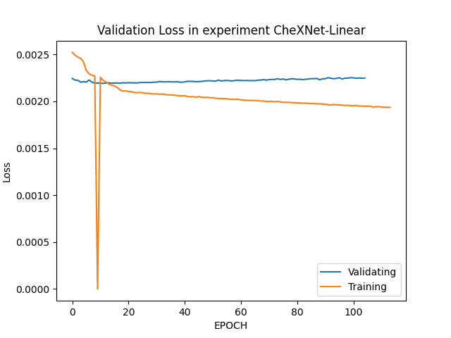|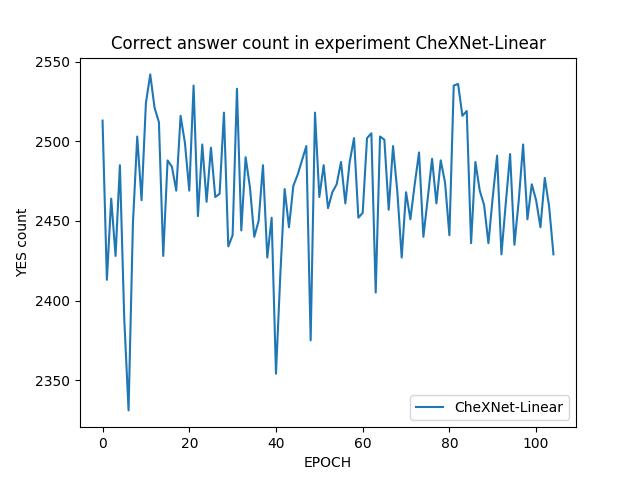|
|CheXNet - Linear - with Reverse Penalty|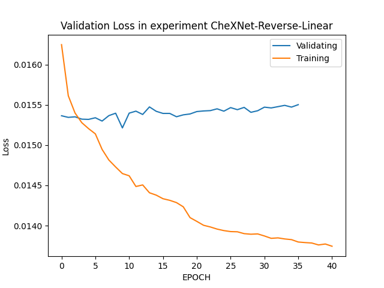|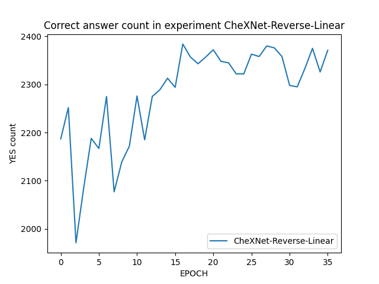|
|CheXpert|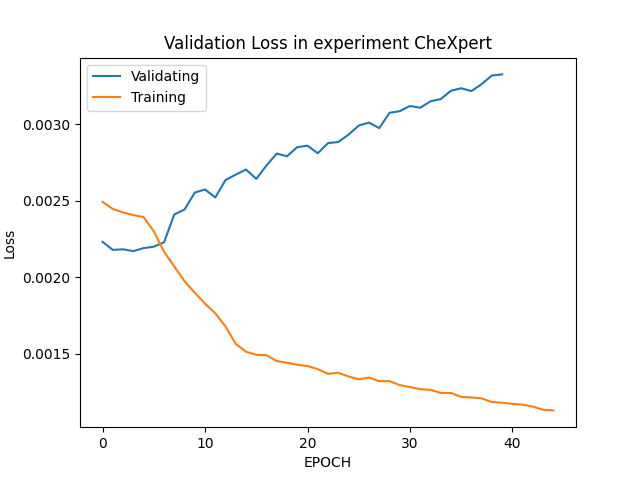|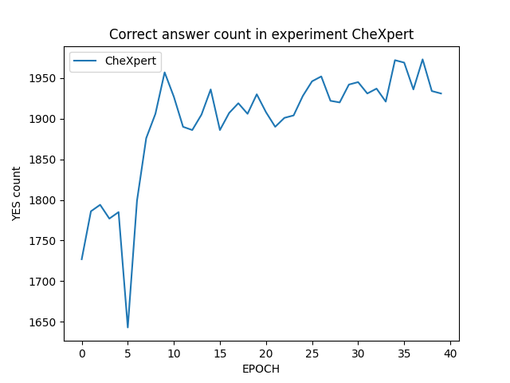|
|CheXNet - TTA|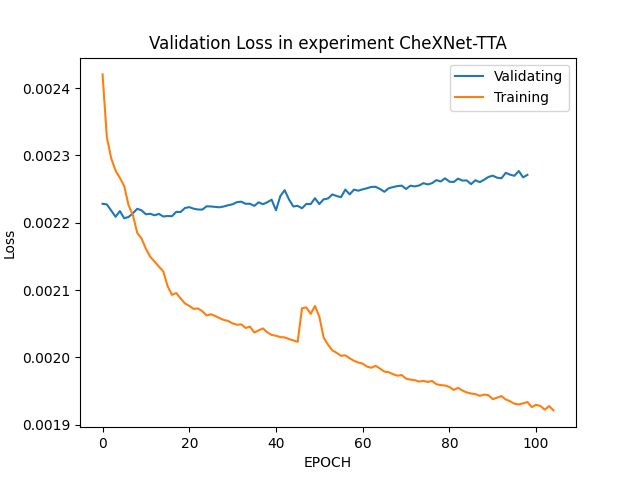|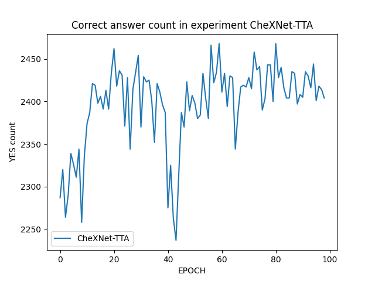|
|CheXNet|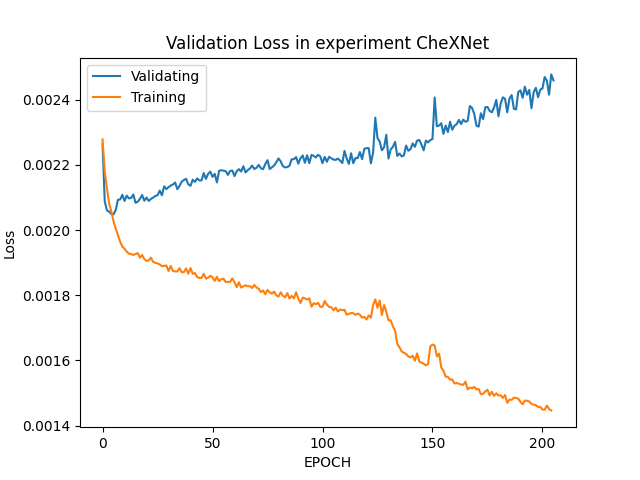|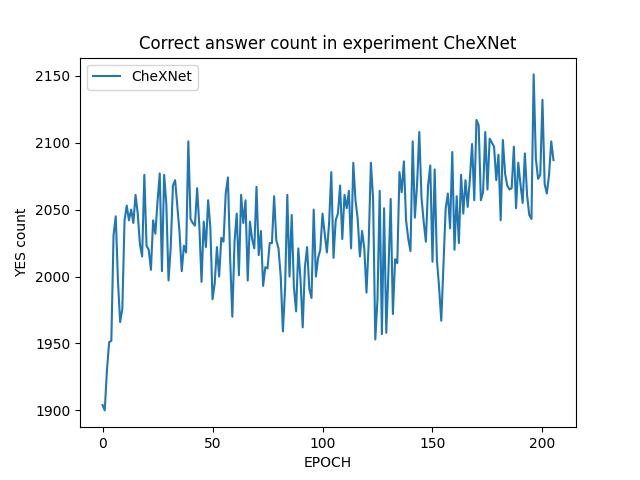|

> ***Loss figure*** 中有些不自然的小突起，這是我們使用隨機重設 ***learning rate*** 的策略所導致的。

我們可以發現，由於使用了預訓練權重，因此模型在非常早的時候就已經對資料集 Overfit 了。

因此我們經過測試， Kaggle 上分數最高的參數為：

```
BATCH_SIZE = 10
INITIAL_LEARNING_RATE = 0.0001
TRANSFORM = True
VALIDATE_RATIO = 0.7
WEIGHT_BALANCE = True
REVERSE_PENALTY = False
STATIC_ROUND = 5
RELU = False
LABEL = Ver 3.0 - Branch CheXNet - Linear
EPOCH -> 13
LEARNING_RATE -> 1e-05
```

其分支為 `CheXNet` ，也就是純粹的 `CheXNet` 。

其 ***Kaggle*** 得分為 $0.3195$ ，是我們組內目前 ***Public Score*** 最高分。


而以下我們列出細項發現：

### TTA

我們嘗試在 ***ChexNet*** 分支上加入 ***TTA*** ，但發現效果極差， ***Kaggle*** 分數一度掉到 $0.1$ ，因此後半部放棄了此選項。

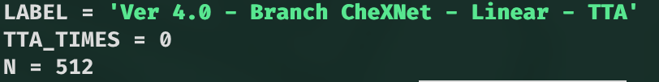

> 如圖，我們在最後階段將環境變數 `TTA_TIMES` 歸零，即使 ***Ver. 4.0*** 的主要更新為 ***TTA***

### Reverse Penalty

因為我們發現本次競賽測試集與官方測試及的差異在於：

 - 官方版為 ***multilabel***
 - 本次競賽為 **將官方版測試集** 標籤以字典序排序後，將第一個標籤作為 ***singlelabel*** 的標準答案。

因此可以推斷 **字典序越靠前，正確率則越高** ，因此我們嘗試對每個 ***class*** 進行 penalty (weight) ，越靠前則權重越高。

但 ***Kaggle*** 分數卻相當不理想，我們猜測是因為測試集相當平均的原因。

以下附上測試圖片證明測試集是平衡的：

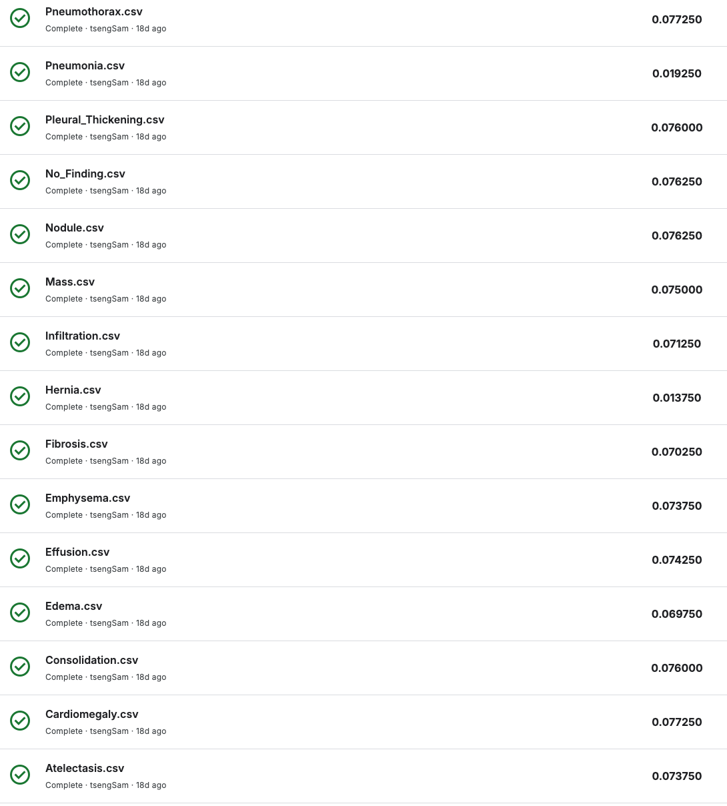

### ReLU v.s. Linear Head

而除了上述實驗，我們還嘗試了不同的 ***classifier head*** ，我們分別使用了 ***ReLU*** 和 ***Linear*** 。

從本章最初的比較表格可以看出， ***Linear head*** 較容易抖動，但單從 ***Loss*** 數值來說則普遍較低，我們推測會有這樣的結果是因為 ***CheXNet*** 本身的預訓練集即包含了本次大部分的分類，因此比起 ***ReLU*** 這類非線性的 ***mapping function*** ， ***Linear head*** 更能夠直接將欲訓練權重「對應」過來。

## 十二、組員合作與工作分配

### 合作方式

此次專案我們採用了 ***GitHub*** 作為協作平台，並且將 `main` 分支定為基礎程式碼庫，而每個人能夠開數支分支分別嘗試不同的實驗流程，以下列出目前專案分支。

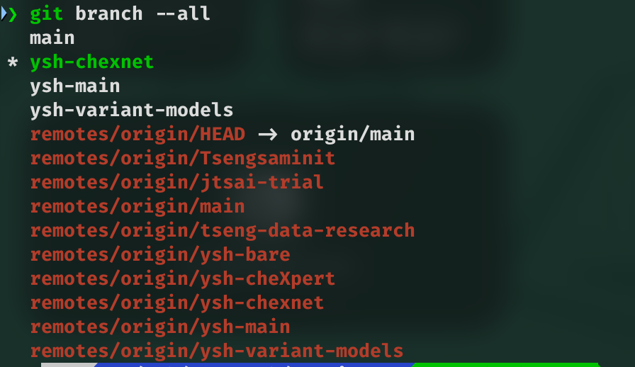

而倉庫位於 https://github.com/mysh212/AI-Final-Project

## 工作分配

 - 楊勝皓
     - ***Model 2*** (branch `ysh-*` ) 負責人
     - 資料分析
     - 撰寫報告
     - 結果分析
 - 蔡承希
     - ***Model 1*** (branch `jtsai-trial` ) 負責人
 - 曾柏誠
     - 資料探勘
     - branch `tseng-data-research` & `Tsengsaminit` 負責人
 - 呂佳諺
     - 投影片製作
 - 王竑文
     - 投影片製作
 - 黃士洵
     - 撰寫報告
     - 投影片製作
     - 報告講師


## 資源們

 - **簡報** https://www.canva.com/design/DAHKp8_TIW8/LeVHqlajXdJjoQLn4E6CKQ/view
 - **GitHub Repository** https://github.com/mysh212/AI-Final-Project
 - **HackMD Report** https://hackmd.io/@mysh212/H1huyG4xMx
 - **Model 1 程式碼** https://www.kaggle.com/code/e24126270/xray-e24126270